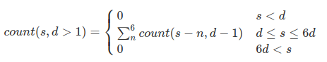

Algorithm to solve the **"How many configurations of 20 dice sum 70?"** problem answered in [es.quora.com](https://qr.ae/pGB07a)

### Presentation

We define **count(S,D)** as "**how many configurations of D dice sum S**".

This definition can be expressed algebraically as

 ,
  

And can be written as a recursive algorithm:

```javascript
/// how many configurations of <d> dice sum <s>?
function count(s, d) {
  if (s < d || d * 6 < s)
    return 0
  else if (d === 1)
    return 1
  else
    return [1, 2, 3, 4, 5, 6].fold( (total, side)=>total+count(s - side, d - 1), 0)
}
```
This algorithm, without any optimizacion, has a complexity order of **O( D * 6^D )** where D is the number of dice.

### The algorithms

The code you can find in this project shows how performance can be improved drastically adding memoization or converting tail recursion to an iterative version.

The evolution is shown with this 4 code files

**solution01_no_memoization.js**  runs the standard algorithm for 2, 4, 5, ..., 12 dice.

**solution02_memoization.js** runs the memoized version for 2,4,6, ..., 150 dice.

**solution03_memoization_with_counters.js** runs the memoized version for 2 to 150 dice adding some counters:

* callsCount:  How many times "count" function has been called.
* memoizedCount: How many values have been memoized.

**solution04_iterative.js** runs the iterative version for 2,4,6,..., 150 dices
The idea:

* Iterative solution generates all counts from **count(1,1)** to **count(sum,dices)** taking into account that each state **count(s,d)** depends, at most, on the state **count(s-6, d-1)**. 

* The tail recursion is ported easily to iterative version  keeping the record of the previously calculated states into a circular array of 7 rows. 

### How to run tests

You need nodejs on your system

If you use Ubuntu linux, you can install it with

> sudo apt install nodejs

To run tests just do

> $ node solution01_no_memoized

or

> $ node solution02_memoized

or

> $ node solution03_memoized_with_counters

or

> $ node solution04_iterative

Anyway,  I include results of this 4 executions (performed with my i5) on **results** folder


### About the dataset

We only test 1 sum for each number of dice **d**: the one with more configurations (the worst case): 

`s = (d + 6d) / 2`

i.e.:

`count(14, 5)`
14 = (5 + 30) / 2

`count(21, 6)`
21 = (6 + 35) / 2

`count(28, 8)`
28 = (8 + 48) / 2

`count(35, 10)`
35 = (10 + 60) / 2
